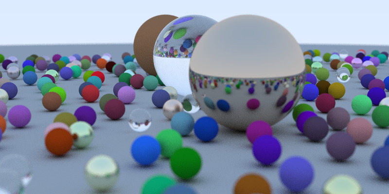

# Ray Tracer

Building a fully functional ray tracer from scratch based on the "Ray Tracing" series by Peter Shirley.

## Example Render
I recreated the cover image of the book "Ray Tracing in one Weekend" using this ray tracer.

### Completed Features

- Spheres and Light Rays
- Antialiasing
- Lambertian, Metal, and Dielectric Materials
- Positionable Camera
- Defocus Blur
- Motion Blur
- Bounding Volume Hierarchy (BVH)

### TODO

- Solid Textures and Texture Mapping
- Perlin Noise
- Rectangles
- Lights
- Instances
- Volumes
